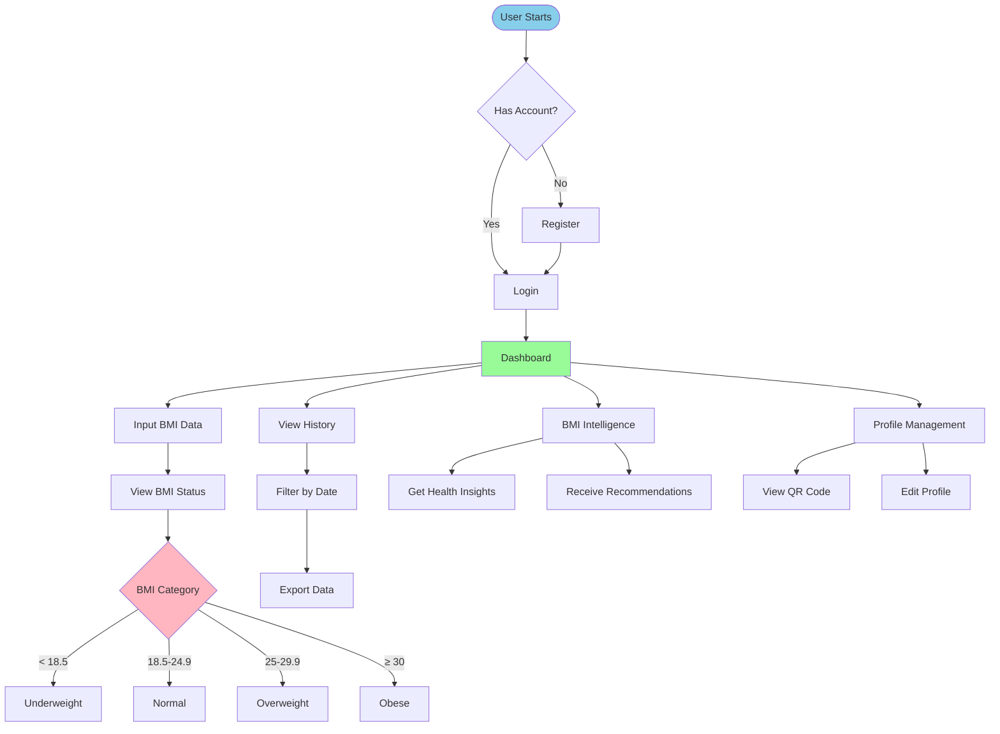

```mermaid
graph TD
    Start([User Starts]) --> A{Has Account?}

    %% Authentication Flow
    A -->|No| B[Register]
    A -->|Yes| C[Login]
    B --> C

    %% Main System Flow
    C --> D[Dashboard]

    %% BMI Management
    D --> E[Input BMI Data]
    E --> F[View BMI Status]
    F --> G{BMI Category}
    G -->|< 18.5| H[Underweight]
    G -->|18.5-24.9| I[Normal]
    G -->|25-29.9| J[Overweight]
    G -->|≥ 30| K[Obese]

    %% Additional Features
    D --> L[View History]
    L --> M[Filter by Date]
    M --> N[Export Data]

    D --> O[BMI Intelligence]
    O --> P[Get Health Insights]
    O --> Q[Receive Recommendations]

    %% Profile Management
    D --> R[Profile Management]
    R --> S[View QR Code]
    R --> T[Edit Profile]

    %% Legend
    style Start fill:#87CEEB
    style D fill:#98FB98
    style G fill:#FFB6C1
```
